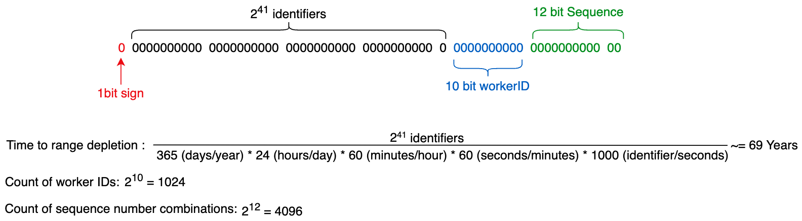

## Motivation:

In big, distributed applications, millions of events can be happening every single second. That could cause all kinds of issues. For example, in such a distributed system, with distributed databases, if the ID's are generated incrementally, this will eventually lead to inconsistent states, where multiple events have the same ID, and the DB wouldn't be able to resolve the conflict. 

Facebook has Canopy, which uses TraceID to identify unique events across all of it's microservices.

## How to design a sequencer:

In order to design a Sequencer, we need two things

1) A unique ID generator: UUID's that won't colide. 
2) Unique IDs with causality: factors time as well.

The crux of the matter is being able to design a system that can generated unique IDs in a distributed system.

## Requirements for IDs:

They need to be **unique**. They need to **scale** up to billions per day. They need **availability**, since we're generate millions a second.

## Solutions:

### First solution: UUID

This is probably the first one that comes to mind. using a UUID with 128 bits gives us 10^38 IDs. With a pseudo-number generator, the probability of collisions is very low, even in a distributed system. 

Two problems arise with this approach.
1) The possibility of collision is near 0, but not 0. If you're a perfectionist you will hate this.
2) using 128-bits for inserts can be kind of slow. We'll have slow inserts and indexing.

### Second Solution: DB

We can have a central DB providing incremental IDs. Each server could request an ID, and the DB would return an ID. Since all requests go through the same DB, it can ensure no duplication, and it can use 64 instead of 128 bits.

But I'm sure you can see why this is problematic. Single point of failure.

However, it doesn't have to be one single DB. We can mitigate this problem by having, for example, 3 DBs. and to avoid collisions, instead of incrementing one, it can increment 3. So, first DB will give out IDs: 1,4,7..., second: 2,5,8... you get the idea.

This is a good and scalable approach, but we still have problems. For one, adding or removing a server can be quite tricky. Also, dealing with failures can also be complex. 

## Third solution: range handler

This one is simple to understand. It's basically the one where we have multiple DBs, but the idea here is to have a central microservice that gives out ranges. So, DB1 requests a range, the central node responds that it can have IDs from 1 to 100.000. DB 2 requests a range, gets back 100.001 to 200.000 and so one. 

Now, the microservice can become our single point of failure, however, we can have a failover service to handle such case. 

This solution is great. But one thing that can be a shortcoming is, when a server dies, we can have a signifcant range "locked" until the server is live again.

## IDs with causality

### Causality:

Causality means that not only are the IDs equal, but they can discern if one happens after the other. For example, if person A posts, and person B replies, the reply can't happen before the post. 

### UNIX time stamps:

You saw this coming. let's just add a timestamp to each event, and then we can be sure one happens after the other. 

Well, for that to work, all servers need to have the exact same time, down to the millisecond, and this just won't happen. So, we'd need a single server to be the source of truth on the timestamps. 

## Twitter Snowflake:

Here's an overview of Twitter Snowflake

- It has a sign bit which is always 0, denoting positive. 
- A timestamp, good for 69 years going forward (with 41 bits)
- 10 bits for workerID, which allows for 1024 parallel workers. Each workers appends their ID here.
- 12 bits for sequence number. every ID generated on the server will add this sequentially, untill it hits 4096, then it resets. This layer helps us avoid duplication.

Shortcoming of this approach: when using multiple servers, we still have the time sync problem. The servers won't have time synchronized down to the millisecond. 

## Logical Clocks
### Lamport Clocks:

- Every node gas a local variable t, started at 0 on each node. 
- Every time an event occurs, we increment t to t+1. 
- Every request to send a message also adds 1 to t, and attaches the t on the message. 
- on recieving t, it looks at local t, looks at recieved t' and does max(t, t') +1.

Hence, lamport clocks will have a t for every event. It can infer causality, albeit, not global causality.

Also, there's a footnote here. If we have a->b, we can guarantee that a's timestamp will be less the b's. However, if they are concurrent, we cannot prove which one came before. And we can have events with the same timestamp.

### Vector Clocks:

Vector clocks maintain causality. However, they can be quite tricky to scaling. 

- Assume n nodes in the system, and all of them are known
- Vector timestam of an event 'a' is a V(a) = [t1, t2, t3...]
- t is the number of events observed by a node
- each node has a current vector timestamp T
- On event at node N increment element T
- attach current vector timestamp to each message
- recipient merges message vector into its local vector (there's an algo for merging)

### TrueTime API

Google's TrueTime API is a good option also. When we request the time, if gives back two values, earliest possible and latest possible timestamps. Google has a GPS receiver or an atomic clock in each datacenter, so clocks are synced to 7ms precision. 

We can generate the unique ID using the intervals. 

- 41 bits for the earliest timestamp
- 4 bits for the uncertainty (~7ms)
- workerID
- sequence number

This is a good solution that scales well, but we still can't 100% guarantee that one item happened before the other, and we're depending on Google, and also paying for that service.

## Conclusion

hopefully by now you know how complex this can get, and what goes into the how we should build a sequencer.