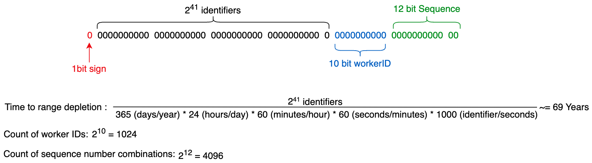

## Motivação:

Em grandes aplicações distribuídas, milhões de eventos podem acontecer a cada único segundo. Isso pode causar todo tipo de problema. Por exemplo, em um sistema distribuído, com bancos de dados distribuídos, se os ID's são gerados incrementalmente, isso eventualmente levará a estados inconsistentes, onde múltiplos eventos têm o mesmo ID, e o banco de dados não seria capaz de resolver o conflito.

O Facebook possui o Canopy, que utiliza o TraceID para identificar eventos únicos por todos os seus microsserviços.

## Como projetar um sequenciador:

Para projetar um Sequenciador, precisamos de duas coisas:

1) Um gerador de ID único: UUIDs que não colidem.
2) IDs únicos com causalidade: consideram também o fator tempo.

O cerne da questão é ser capaz de projetar um sistema que possa gerar IDs únicos em um sistema distribuído.

## Requisitos para os IDs:

Eles precisam ser **únicos**. Eles precisam **escalar** para bilhões por dia. Eles precisam de **disponibilidade**, já que estamos gerando milhões por segundo.

## Soluções:

### Primeira solução: UUID

Esta é provavelmente a primeira que vem à mente. Usar um UUID de 128 bits nos dá 10^38 IDs. Com um gerador de números pseudo-aleatórios, a probabilidade de colisões é muito baixa, mesmo em um sistema distribuído.

Dois problemas surgem com essa abordagem.
1) A possibilidade de colisão é próxima de 0, mas não é 0. Se você é perfeccionista, vai odiar isso.
2) Usar 128 bits para inserções pode ser meio lento. Teremos inserções e indexação lentas.

### Segunda Solução: Banco de Dados

Podemos ter um banco de dados central fornecendo IDs incrementais. Cada servidor poderia solicitar um ID e o banco de dados retornaria um ID. Já que todas as solicitações passam pelo mesmo banco de dados, ele pode garantir que não haja duplicação, e pode usar 64 em vez de 128 bits.

Mas tenho certeza que você pode ver por que isso é problemático. Ponto único de falha.

No entanto, não precisa ser um único banco de dados. Podemos mitigar este problema tendo, por exemplo, 3 bancos de dados. E para evitar colisões, em vez de incrementar um, ele pode incrementar 3. Então, o primeiro banco de dados fornecerá IDs: 1,4,7..., o segundo: 2,5,8... você entendeu a ideia.

Esta é uma abordagem boa e escalável, mas ainda temos problemas. Por exemplo, adicionar ou remover um servidor pode ser bastante complicado. Além disso, lidar com falhas também pode ser complexo.

## Terceira solução: controlador de intervalos

Esta é simples de entender. É basicamente aquela em que temos vários bancos de dados, mas a ideia aqui é ter um microserviço central que distribui intervalos. Então, o DB1 solicita um intervalo, o nó central responde que ele pode ter IDs de 1 a 100.000. O DB2 solicita um intervalo, recebe de volta 100.001 a 200.000 e assim por diante.

Agora, o microserviço pode se tornar nosso ponto único de falha, no entanto, podemos ter um serviço de failover para lidar com tal caso.

Esta solução é ótima. Mas uma coisa que pode ser uma desvantagem é que, quando um servidor cai, podemos ter um intervalo significativo "bloqueado" até que o servidor esteja ativo novamente.

## IDs com causalidade

### Causalidade:

Causalidade significa que não apenas os IDs são iguais, mas eles podem discernir se um acontece após o outro. Por exemplo, se a pessoa A posta, e a pessoa B responde, a resposta não pode ocorrer antes da postagem.

### Carimbos de tempo UNIX:

Você previu isso. Vamos adicionar um carimbo de tempo a cada evento e então podemos ter certeza de que um acontece após o outro.

Bem, para que isso funcione, todos os servidores precisam ter exatamente o mesmo tempo, até o milissegundo, e isso simplesmente não vai acontecer. Então, precisaríamos de um único servidor para ser a fonte da verdade sobre os carimbos de tempo.

## Twitter Snowflake:

Aqui está uma visão geral do Twitter Snowflake

- Possui um bit de sinal que é sempre 0, denotando positivo.
- Um carimbo de tempo, bom por 69 anos para frente (com 41 bits)
- 10 bits para workerID, que permite 1024 trabalhadores paralelos. Cada trabalhador acrescenta seu ID aqui.
- 12 bits para número de sequência. Cada ID gerado no servidor adicionará isso sequencialmente, até atingir 4096, então ele reinicia. Esta camada nos ajuda a evitar duplicação.

Desvantagem desta abordagem: ao usar vários servidores, ainda temos o problema de sincronização de tempo. Os servidores não terão tempo sincronizado até o milissegundo.

## Relógios Lógicos
### Relógios de Lamport:

- Cada nó tem uma variável local t, iniciada em 0 em cada nó.
- Toda vez que um evento ocorre, incrementamos t para t+1.
- Toda solicitação para enviar uma mensagem também adiciona 1 a t e anexa o t na mensagem.
- Ao receber t, ele olha para o t local, olha para o t' recebido e faz max(t, t') +1.

Portanto, relógios de Lamport terão um t para cada evento. Eles podem inferir causalidade, embora não causalidade global.

Além disso, há uma nota de rodapé aqui. Se temos a->b, podemos garantir que o carimbo de tempo de a será menor que o de b. No entanto, se eles forem concorrentes, não podemos provar qual veio antes. E podemos ter eventos com o mesmo carimbo de tempo.

### Relógios Vetoriais:

Relógios vetoriais mantêm a causalidade. No entanto, podem ser bastante complicados para escalar.

- Suponha n nós no sistema, e todos eles são conhecidos
- O carimbo de tempo vetorial de um evento 'a' é um V(a) = [t1, t2, t3...]
- t é o número de eventos observados por um nó
- cada nó tem um carimbo de tempo vetorial atual T
- Em evento no nó N, incrementa-se o elemento T
- anexa o carimbo de tempo vetorial atual a cada mensagem
- o destinatário mescla o vetor da mensagem em seu vetor local (há um algoritmo para mesclar)

### API TrueTime

A API TrueTime do Google é também uma boa opção. Quando solicitamos o tempo, ela retorna dois valores, os carimbos de tempo possíveis mais cedo e mais tarde. O Google tem um receptor GPS ou um relógio atômico em cada datacenter, então os relógios são sincronizados com uma precisão de 7ms.

Podemos gerar o ID único usando os intervalos.

- 41 bits para o carimbo de tempo mais cedo
- 4 bits para a incerteza (~7ms)
- workerID
- número de sequência

Esta é uma boa solução que escala bem, mas ainda não podemos garantir 100% que um item aconteceu antes do outro, e estamos dependendo do Google, além de pagar por esse serviço.

## Conclusão

Espero que agora você saiba o quão complexo isso pode se tornar e o que se leva em conta na construção de um sequenciador.

